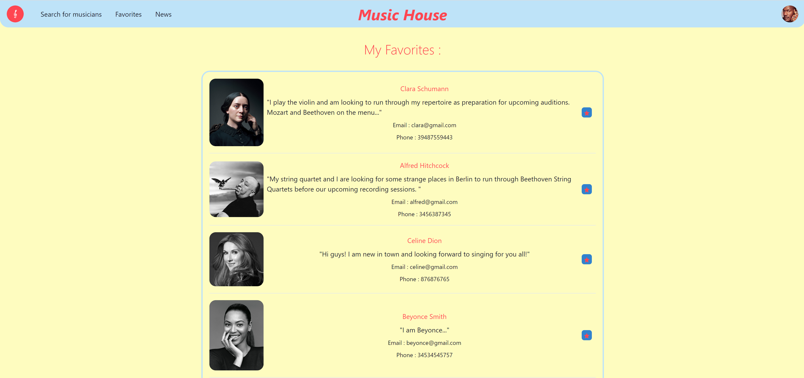

# Music House

<p align="center"> 
  
</p>

Music House is an app which helps the classical music community to thrive by providing a straightforward way for musicians and hosts to find each other. 

## Screenshots

<p align="center" >
  
</p>
<p align="center" >
  
</p>

## Getting started

Follow these instructions to setup your own environment to run Music House.

* [Firebase](https://firebase.google.com/) - a Google Back-end service provider

  Follow the steps to create a project with their free-tier option, and extract the project's config JSON file variables into your 
  .env file (which should be located at the root of your project folder).

  Note that you will need to initialize the Auth Services (with Email/Password option), as well as the Realtime Database and Storage Services.

  Your .env file should look like this, with the variable values being the actual values given in your Firebase config object.

```bash
REACT_APP_API_KEY=apiKey
REACT_APP_AUTH_DOMAIN=authDomain
REACT_APP_PROJECT_ID=projectId
REACT_APP_STORAGE_BUCKET=storageBucket
REACT_APP_MESSAGING_SENDER_ID=messagingSenderId
REACT_APP_APP_ID= appId
REACT_APP_MEASUREMENT_ID=measurementId
REACT_APP_DATABASE_URL=databaseURL
```

## Installation

1. Clone this repo and enter!

   ```bash
   git clone https://github.com/MarkKagan/musichouse
   cd musichouse
   ```

2. Install dependencies.

   ```bash
   npm install
   ```

3. Run the app.

    ```bash 
    npm start
    ```

## Tech Stack

* React
* Firebase Auth
* Firebase Realtime Database
* Firebase Storage
* Leaflet API
* OpenStreetMap API
* Chakra UI

## Contact

* Mark Kagan - [GitHub](https://github.com/MarkKagan) - [LinkedIn](https://www.linkedin.com/in/mark-kagan/)

